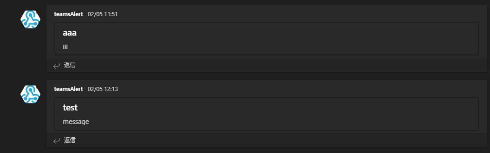

## [laravel]chatwork通知からTeams通知へ移行する方法
Chatworkに通知用のアカウントを用意し、エラーや処理の通知を行っていたが、Teamsを使うことになり、通知をTeamsで行うことになったのでその方法を記述していく。
> 使用環境
laravel: 5.4.x
php: 7.0

### 1. webhookURLをTeamsから取得する
1. Teamsのチームを選択
2. チャンネルの設定(…)をクリックしして「コネクタ」を選択
3. 「Incoming Webhook」を選択し、アカウントを作成する
4. URLをコピーしておく

### 2. URLを読み込めるように設定する
1. URLを読み込めるように.env関連ファイルにURLを記載する
    ```
    #teamsWebHookUrl
    NOTICE_WEBHOOK_URL=https://webhook.office.com/...
    ALERT_WEBHOOK_URL=https://webhook.office.com/...
    ```
2. config/teams.phpを作成してconfigからenvの値を取得できるようにする
    ```
    <?php
    return [
        'channel' => [
            'webhook_url' => [
                'notice' => env('NOTICE_WEBHOOK_URL'),
                'alert' => env('ALERT_WEBHOOK_URL')
            ]
        ],
    ];
    ```

### 3. Teams通知を送る関数を作成する
1. teams通知はpostで送るため、GuzzleHttpをインストールする
    ```
    composer require guzzlehttp/guzzle
    ```
2. app/Models/Teams.phpを作成する。Chatwork.phpがある場合はそれを参考にする
    ```
    namespace App\Models;
    use GuzzleHttp\Client;

    class Teams
    {​​​​​​​​​​​​
        private function alert($title, $message, $webhookUrl = null){​​​​​​​​​​​​​
            $_webhookUrl = empty($webhookUrl) ? config('teams.channel.webhook_url.notice') : $webhookUrl;
            $method = "POST";
            $data = [
                'json' => [
                    "title" => $title,
                    "text" => $message,
                ],
                "headers" => [
                    'Content-Type' => 'application/json',
                ],
                "format" => "json",
            ];
            $client = new Client();
            $client->request($method, $_webhookUrl, $data);
        }​​​​​​​​​​​​​​​​​​​​​​​​​​​
    }
    ```

### 4. Chatwork通知を行っている箇所を全てTeams関数に置き換える
1. chatworkで全文検索かけ、作成したteams::alert()をchatwork通知していた箇所に置き換える
    ```
    use App\Models\Teams;

    $webhookUrl  = config('teams.channel.webhook_url.notice');
    $title = "title";
    $messages = "message";
    Teams::alert($title, $messages, $webhookUrl);
    ```

### 5. 検証する
1. しっかりと通知が飛ぶか`php artisan tinker`等で検証する
    ```
    php artisan tinker

    >>> use App\Models\Teams;
    >>> $webhookUrl = config('teams.channel.webhook_url.notice');
    >>> $title = "title";
    >>> $messages = "message";
    >>> Teams::alert($title, $messages, $webhookUrl);
    ```

2. teamsに通知がくる
