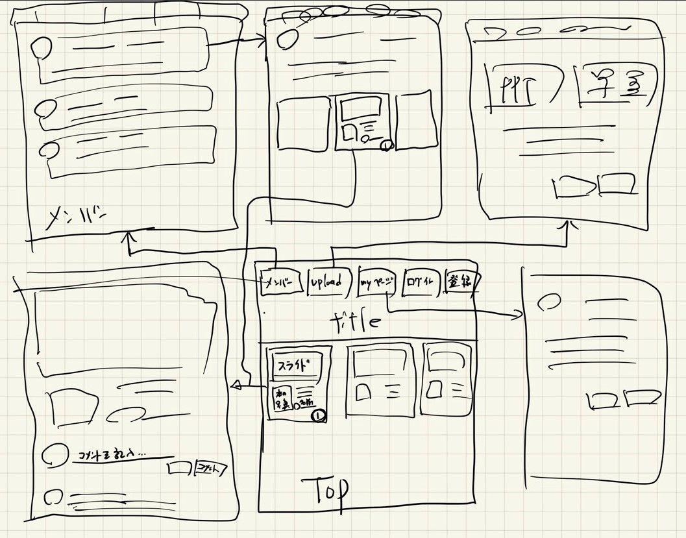

[参考サイト](https://qiita.com/Saku731/items/741fcf0f40dd989ee4f8)
[作成中bookapp](http://13.114.48.84/)

# 今後のタスク
- []pptをPDFもしくは画像に変換する処理
- []画像フォルダを読込ある分の画像をスライドで表示
- []画像を日付毎にフォルダでS3に保存
- []新規登録やコメントがあった際にTeamsに通知
- []UI/UXを整える

# 要件定義～システム設計

## 要件定義
- 要望：こんなシステムがあったらいいなといったアイディア(発注者)
	- 現状の課題
	- ゴール
	- 現状とゴールのギャップ
- 要求：システムに実装してほしい大まかな機能一覧(発注者)
	- 企画の背景
	- 会第解決に必要なシステムの概要
	- 具体的に実装したい機能一覧
- 要件：双方が合意した具体的な機能一覧と実装方法(開発者)
	- 技術的に開発可能か
	- 予算はどの程度必要か
	- 納期はいつ頃になるか
- 提案：検討した結果を発注者に戻す(開発者)
	- 実装できる機能
	- 請求する金額
	- 納品できる期日
- 要件：双方が合意した決定事項
	- システムに実装しる機能一覧
	- 納期、請求額の目安が記載されるケースもある

## 要件定義で決める時候
- Why
	- 現状の課題
		- <strong>PPTや書籍一覧、感想などがばらばらに保管されている</strong>
	- ゴール
		- <strong>書籍の写真、PPT、コメントを1つにまとめる</strong>
	- 現状とゴールのギャップ
		- <strong>書籍ツール、共有フォルダ、Teams投稿を使っているが、laravelにまとめる</strong>
- What
	- システム導入後の業務フロー
	- 機能要件
		- システムに実装する機能一覧
	- 非機能要件
		- 処理スピード、セキュリティ、
- How
	- 基本設計
		- 画面設計(UI設計)
		- 機能設計
		- データ設計
	- 詳細設計
		- クラス図、シーケンス図
		- システムアーキテクチャ
		- 各部位を実装する技術

## 基本設計の作り方
- 画面設計（UI設計）
	- 各画面で何ができるのか？
	- 表示する情報（文字、画像など）とレイアウト
	- 上記を画面遷移図にまとめる
- 機能設計 
	- 裏側の処理（機能名と処理内容）
	- 処理に必要なデータ、データの取得元（画面から入力、DBから取得 など）
	- 処理したデータの受渡し先（画面表示、DBへ保存 など）
- データ設計
	- データの具体的な中身
	- データベース設計
	- データの流れ（データフロー）

  

## 機能設計
- 裏側の処理(機能名と処理内容)
- 処理に必要なデータ、データの取得元（画面から入力、DBから取得など）
- 処理したデータの受け渡し先(表示画面、DBへの保存など)

|  機能名  |  会員情報を登録する  |
| ---- | ---- |
|  処理内容  |  - 入力フォームから情報を受け取る  - 会員情報をDBに保存  |
|  必要データ | - 会員情報 |
|  取得元 | - 入力フォーム |
| ユーザー操作 | - フォームに入力  - 「アカウント作成」をクリック |
  

|  機能名  |  マイページ  |
| ---- | ---- |
|  処理内容  |  - DBから会員情報を取得  - 会員情報を画面に表示  -   |
|  必要データ | - 会員情報 |
|  取得元 | - DBからの取得 |
| ユーザー操作 | - 特になし |
  

|  機能名  |  メンバー一覧  |
| ---- | ---- |
|  処理内容  |  - DBから会員情報を取得  - 会員情報を画面に表示  -   |
|  必要データ | - 会員情報 |
|  取得元 | - DBからの取得 |
| ユーザー操作 | - メンバーをクリック |
  

|  機能名  | メンバー詳細  |
| ---- | ---- |
|  処理内容  |  - DBから会員情報を取得  - 会員情報を画面に表示  - スライド情報を取得  - スライド情報を表示   |
|  必要データ | - 会員情報  - スライド情報 |
|  取得元 | - DBからの取得 |
| ユーザー操作 | - スライド詳細をクリック |
  

|  機能名  |  スライド詳細  |
| ---- | ---- |
|  処理内容  | - スライド情報をDBから取得  - スライド情報を画面に表示  - コメント情報を表示  - コメント情報をDBから取得   |
|  必要データ | - スライド情報  - コメント情報 |
|  取得元 | - DBからの取得 |
| ユーザー操作 | - コメントを記入する |
  

...

## データ設計
- データの具体的な中身
- データベース設計
- データの流れ(データフロー)

### データは大きく分けて4種類
- プログラムに「入力する」データ(引数)
	- web画面からユーザーが入力するデータ
	- データベースから読み取るデータ
- プログラムから「戻ってくる」データ(戻り値)
	- web画面に表示させるデータ
	- データベースに保存するデータ

### データの具体的な中身
- 会員情報
	- 名前
	- メアド
	- パスワード
	- 簡単な紹介
	- 好きな本
	- 好きな本2 
	- 好きな本3

- スライド情報
	- PPT資料
	- 書籍画像
	- 読んだ本のタイトル
	- コメント

- コメント
	- 会員ID
	- 名前
	- コメント内容
	- 投稿日時

### データベース設計
- テーブルの役割を「マスター」と「履歴」に分ける
- テーブル間の参照関係を整理する
- 参照関係をER図に書き起こす

- マスター
	- 会員テーブル
	- スライドテーブル
- 履歴：システムが利用される中で蓄積するデータ
	- コメントテーブル

### ER図
会員マスタ - + スライドマスタ - + コメント

